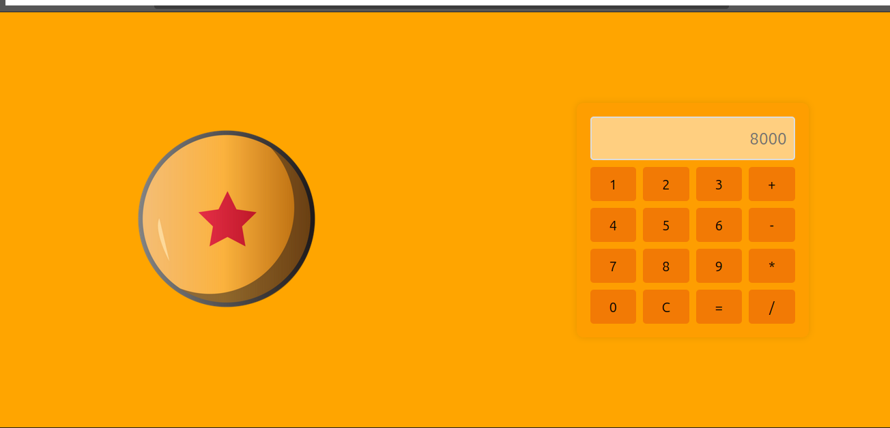
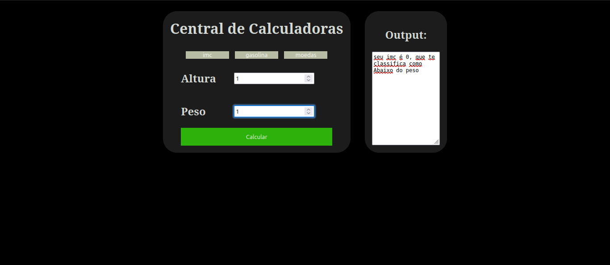

# Calculadora DragonBall

Calculadora básica temada em DragonBall, se o valor do resultado de qualquer operação for maior que oito mil a calculadora fará um som nostálgico :sunglasses:

# Tripla Calculadora 

Calculadora avançada para três tarefas específicas:
1. Cálculo de IMC
   Calcula o IMC com base no peso e altura e em seguida exibe a classificação apropriada.
2. Cálculo de Preço da Gasolina
   Informa a melhor opção de combustível dado a razão de custo-benfício.
3. Cálculo de câmbio monerário Real x Dólar
  Realiza uma simulação de câmbio monetário de uma suma em reais com base no seu valor quanto a cotação do dólar.

Screenshot de versão antiga.
